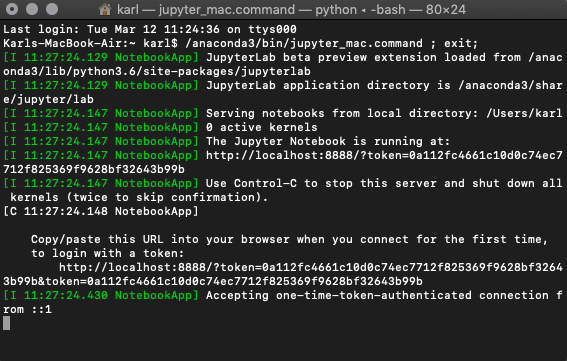
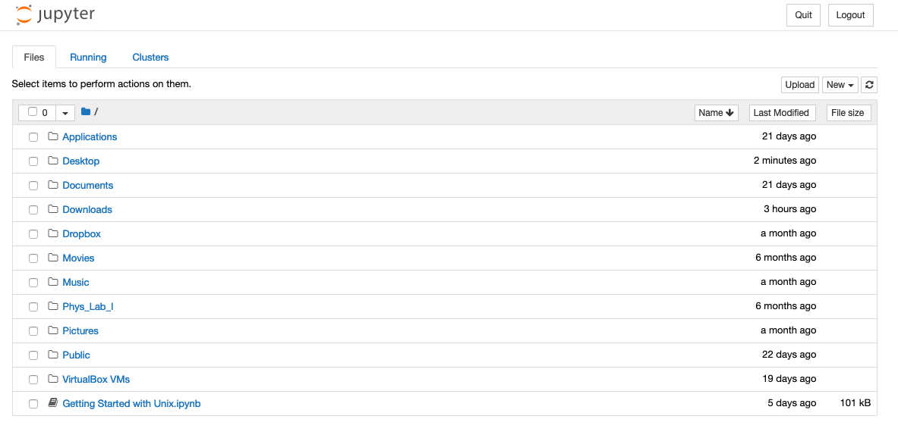
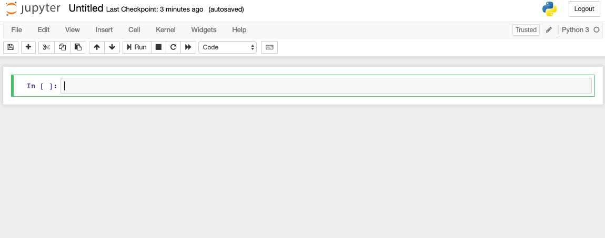
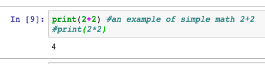
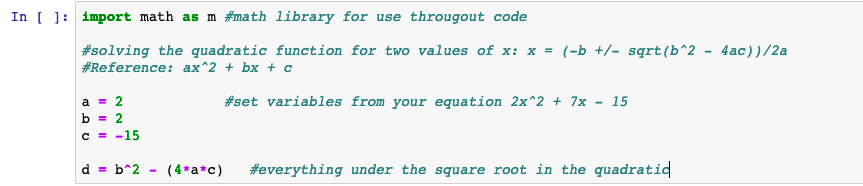
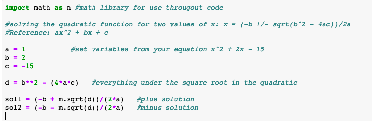
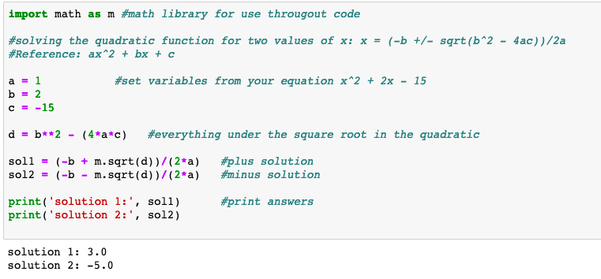

= Installing Anaconda

Head to the https://www.anaconda.com/distribution/[Anaconda website] and pick the newest version of Anaconda for your operating system: macOS, Windows, or Linux. The Graphical Installer is the most user friendly way to install but you can choose the command-line option if you prefer. For some extra information, check out this https://docs.anaconda.com/anaconda/install/[website] for install details on any operating system.

= Getting Started

Each time you want to start a new session with Python or any of the applications in Anaconda, you will need to launch Anaconda. If you chose the Graphical Installer, the process should have created a desktop or applications start button (I locked Anaconda to my dock). If you put the start button in an easily accessible place you’ll use it more!

Now, launch Anaconda and the Navigator should popup in a few seconds and select Jupyter Notebook.

When you do that, you’ll notice that a terminal or command window will also start. That’s because Jupyter Notebooks and Python in general can be written directly through your machine and not just on the web.

This will also launch a new window or tab in your default web browser, bringing you to the Jupyter Notebook home screen. Here, in particular, you can see how Python/Anaconda/Jupyter is connected to your computer. From this menu, you can create new Notebooks, edit existing Notebooks, or import new ones.

= Jupyter Notebook Example

Once Jupyter Notebook is launched, in the upper right corner of the browser, click “New” and select Notebook: Python (my version in Python 3). This will open a new window or tab in your web browser similar to this.

We are going to write some code to solve quadratic equations, so change the title of the Notebook to “Quadratic Formula Solver”. This is a great little problem because it has multiple functions and parts that spit out two different solutions; we’ll need to think through the detailed components as a part of the whole equation. As a reminder, here is our equation:

$$x = \frac{−b \pm \sqrt{b^2 − (4 a c)}}{2 a}$$

On its face, Jupyter Notebook can do some basic calculations. Type `2+2` in the the first command line and hit the “Run” button at the top of the page. Python is smart enough to interpret this simple request and spits out an output, 4, but that isn’t great coding, or, if imbedded in a long line of code, could be confusing to a different user or you if you forget why you wrote that particular line. 

Let’s get a similar answer but with more details. In the next command line, type `print(2+2)` and add the comment `#example of basic math with 2+2`. Now hit the Run button and you should have the same output as before but this time we have better code and comment.

Notice that everything after the `#` is italicized, doesn’t print as an output, or effect your code. You can use `#` throughout your code to leave explanations for certain lines of code or save a modifying/alternate code for later use.

Go back to the first input and add a new line under the first: `$$#print(2*2)$$`. Now run that line again (A shortcut for run is command return or control return). Again, notice that you only get one output of `4` even with the command `print(2*2)` in there. This is a great way to save code that modifies or alters something earlier on in your code but that you don’t want running all the time. You can go back later and delete the `#` and that line will run.

Now let’s get started on our quadratic code. In an effort to help you practice and remind you why certain lines were added, be explicit in your #comments throughout this process. The first step is importing more advanced mathematical functionality with `import math` or `import math as m`. `import as` allows you to call up your libraries without having to type the full name of the library every time you use it. For this example we won’t use it too frequently and `math` doesn’t take that long to type, but, at some point you’ll probably need to use the library `matplotlib.pyplot` and no one wants to type `matplotlib.pyplot` more than once (even twice right now was horrible!). 

Ok, we have our math library imported, time to start setting our variables. In this case, x is our output/dependant variable, so we should start defining our independent variables first: a, b, and c. And let’s use the equation:

$$x^2+2x−15 = 0$$

Defining basic variables is as simple `a = 1`, `b = 2`, and `c = -15`. To help keep the code a bit more legible, we’ll also create a new variable, d, to represent the value underneath the square root. `d = b**2 - (4*a*c)`. (Be careful: Python doesn’t recognize the caret symbol “^” as an exponent). So, this is a slightly more complicated variable because it is built on other variables but Python will reference the values we defined earlier for us. If we come back to use this code later, we would just need to change the values for a, b, and c and leave d alone.

As you know, the quadratic equation gives you two values for x so that the equation equals zero. Let’s define the first value for the “plus” and the second solution for the “minus”; `sol1 = (-b + m.sqrt(d))/2*a` and `sol2 = (-b - m.sqrt(d))/2*a`. 

So now we have equations for both values of x that solve the quadratic equation but Python doesn’t know what to do with that information. We could just say `print(sol1, sol2)` and spit out the answers, but that would have no context. We can add some text to the output by using quotes in the print command. `print(‘Solution 1:’, sol1)` and `print(‘Solution 2:’, sol2)` gives some context to our output. If you run your code now, you should get your answers:

