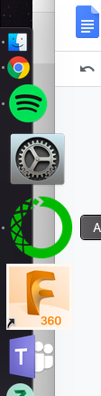

= Installing Anaconda

Head to the https://www.anaconda.com/distribution/[Anaconda website] and pick the newest version of Anaconda for your operating system: macOS, Windows, or Linux. The Graphical Installer is the most user friendly way to install but you can choose the command-line option if you prefer. For some extra information, check out this https://docs.anaconda.com/anaconda/install/[website] for install details on any operating system.

= Getting Started

Each time you want to start a new session with Python or any of the applications in Anaconda, you will need to launch Anaconda. If you chose the Graphical Installer, the process should have created a desktop or applications start button (I locked Anaconda to my dock). If you put the start button in an easily accessible place you’ll use it more!

