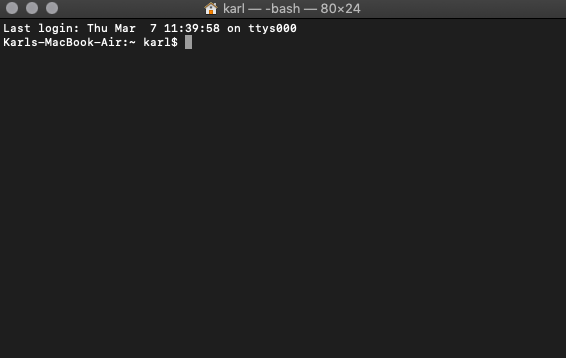
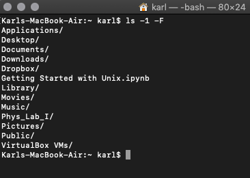
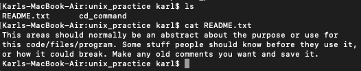

= Find and Explore the Terminal on a Mac

Press the Command button and space bar at the same time to pull up the search function on your computer. Type "Terminal" and enter to start a terminal session. You should get a screen along these lines:

== Where are you on your computer?

Type `pwd` (Print Working Directory) and enter/return to find your working directory. It should say something like `/User/Karl` (well, probably your user name, not mine). Type `pwd` at any time in a terminal session and you’ll find out where you are on your computer. The `/` means “directory” but I think it is easier to think of it as a folder: a place that holds other folders, files, and applications. Also, the full location of any file, program, or directory is listed after directories and slashes: `/User/Karl/Applications/AMBER18…` and so on. You can always call up a file or enter a directory if you know the full path. Once you spend some time using the terminal, locations and file paths will become more familiar and you will start to define your own best practices for file names and locations.

== What's here?

Type `ls` (List Directory Contents) and it will return everything in the current directory. If you are in `/Users/”Your Name”` you should have a list of various directories on your machine: Desktop, Applications, Documents, Pictures… To get a little more information `ls -F` will return the same list but this time with `/` after each directory. That `-` followed by different letters or numbers is a “switch” or “option” added to the initial command `ls`. From time to time, modifying how a search returns information can be useful. `ls -1` returns the same list but in one column and in alphabetical order. `ls -1 -F` will return your list in alphabetical order and distinguish directories from other files. I highly recommend checking out some of the other modifiers using `man ls` to get the entire List Manual. `man “any command”` give you a long list of options and uses for that command (sometimes easier than searching on the web, sometimes not). 

== Changing Locations and Exploring

Ok, now let’s change our location using `cd` (Change Directory). Try `cd Desktop` should get you into your desktop folder and your command line should have changed from just your username to something like `Desktop Karl$`. Check where you are with `pwd`. You should be just a bit further on the path from your first print directory: `Users/Karl/Desktop/`. See what is in this directory with `ls`. Hopefully, you aren’t a psychopath with thousands of files and folders on your desktop and the list is short.

Before moving on, I highly recommend exploring various folders, directories, and files on your own computer. It is super helpful when you can navigate and understand the structure of your own machine. Just jump around and see where things are located. A couple useful tools for “jumping backwards” are `cd ..` to go back up one folder. Just using the command `cd` will return you to your default location, where we started. So, enter some directories with `cd “directory name”` and list the contents with `ls` and use the options to help identify directories from files. I cannot stress it enough how important it is to have a basic understanding computer's architecture.

== Creating a Directory/Folder
Let’s make a new folder/directory on the desktop. If you aren’t on the desktop, return to your main directory with `cd`, then navigate to your desktop with `cd desktop/` or whatever path get’s you there. While you are in a certain directory, everything you create will be created in that directory, so you don’t have to select a “save location”. However, this is why it is so important to know where you are on your machine at all times because you could create files in random places if your aren't careful.

=== Modify a Directory
Use `mkdir "unix prac"` (Make Directory) to create a practice folder on your desktop. Use `ls` again to get a list of the items on your desktop and "unix prac" should be on the list. However, that space in the directory name is going to be a pain in the butt. If we wanted to enter or modify that folder, we would need to use quotes around the “unix prac” every time because Linux uses spaces between commands and functions. `cd unix prac` would attempt to modify unix with prac but that isn’t a function and you’ll get an error. So, let’s rename the folder. `mv “unix prac” unix_prac` will change the folder’s name with the "Move" command. Here you can see how spaces in the folder name would affect the command because the computer reads the spaces as `mv (from) location (to) location`.

I still don’t like that name, so let’s delete it entirely using `rm` (Remove). `rm unix_prac` should return a warning like “unix prac is a directory”. If you run `ls`, unix_prac should still be on your desktop. Try `man rm` to get the Manual for Remove. There are a lot of options for `rm` but keep looking for `-d`. Run `rm -d unix_prac` and check that that folder has been removed from your desktop with `ls`.

== Create Files
Create a new practice folder named “Unix_Practice” and then change your directory inside that folder, `cd Unix_Practice`. Now we’ll add a couple files. `touch README.txt` will create an editable text file. Again, run `ls` to make sure your file was created in your Unix_Practice folder. `nano README.txt` will allow you to enter into the file (Nano is the basic text program for Macs). ReadMe files typically describe a program’s use and maybe a bit about it’s creator, so add a couple of your own lines of text in the editor. Control “o” will allow you to save changes and control “x” brings you back to the directory.

An alternative way to create a file is simply entering Nano with the command `nano`. Write one command, define its function, save the file, and exit back to the directory. Run `ls` and you should see two files in your Unix_Practice folder. Using `cat` (Concatenate) to print the contents of a text file instead of entering a file to read it. `cat README.txt` should display the contents of your text file.

== Moving Files
You can see a quick example of the structure of your computer by moving one of the text files from your Unix_Practice folder to your desktop. You cannot simply type `mv README.txt desktop/readme.txt` because desktop isn’t a stand alone location. You computer doesn’t know if you have multiple directories called desktop and it won’t go looking for the right one on its own. We need to be explicit. You’ll need to use the directions from the `pwd` printouts from earlier. On my machine, this command would look like this `mv README.txt /users/karl/desktop/README.txt`. If you executed this command correctly, `ls` would  only show one text file in Unix_Practice.

This is really similar to the renaming move we made earlier. If you wanted you could change the location of your file and change the name all at once. Now, navigate to the desktop and run the list command and your readme file should be listed. For some extra practice, move the readme file back into the Unix_Practice folder (you do not have to be in the desktop directory to do it but there is more typing if you aren't).

== Pro Tips
A couple useful tricks that might help speed things up. While in the terminal, you can call up previous command lines by pressing the up arrow on your keyboard. From there, you can cycle through all the commands you have typed recently with up and down. This is especially helpful when you make a mistake and the terminal doesn’t execute your opperation. Pressing up once will bring up the last command line and you can edit whatever you typed. The typical mistake is a basic spelling mistake, typing error, or syntax error like forgetting a backslash. Make your adjustments and run the line again instead of retyping the whole thing.

Another useful tool is the tab button; it will help fill in the rest of a command. For example, if you only type `Des` then tab, it will fill in the remainder of `Desktop/`. This trick becomes particularly helpful when you are trying to navigate a long path and don’t want to type every letter of every directory. It also helps cutdown on spelling mistakes, which you will find incredibly annoying after a handful of errors. However, similarly named files in the same directory will obviously cause some issues, so be careful. Also, our computers are precise machines, so capitalization often factors into operations. Typing `des` and tab probably won’t complete your command.

== More Practice
If you found this useful but want to learn more, please check out http://swcarpentry.github.io/shell-novice/[Software Carpentry’s Unix Tutorial]. You’ll find even more terminal practice and some great tutorials on other programs. 

