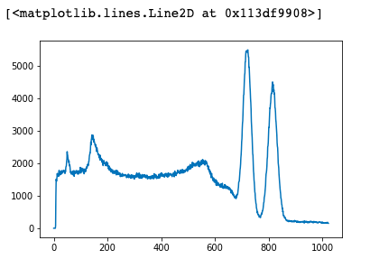
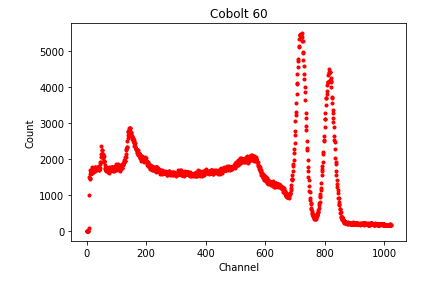

= Practice Experiment

We are going to follow part of an experiment using five known radioactive samples to identify one unknown sample. This experiment measured the gamma decay of various isotopes and we’ll be focusing on the data from Cobalt 60. Photons were shot at a sample of Co60 while in a photo channel analyzer, bounced around at different angles and speeds. A good portion of the photons made it all the way through the analyzer and distributed into different channels based on their frequency. In general, the data in this tutorial show the number of photons detected in various frequency channels.

= The Set Up

If you have little or no experience with Python, we highly recommend switching over to Getting Started with Python Tutorial before working through this tutorial.

The first step is determining what libraries we might need. You can always import libraries as needed but we have a strong idea of how we’ll analyze this data and here’s the general logic. The data is in a csv file, so `import pandas as pd` will allow us to read and manipulate the flie. We'll want to perform some math with this array, so `import numpy as np` will be very useful (this is one of the more widely used libraries in science research). And finally, we want to see the data, so `import matplotlib.pyplot as plt` will help us visualize our results.

= Set Up Data for Analyzing

Download the file link:_includes/user/karl/doc-python/Co60.csv[Co60] and remember where you saved it. Depending on your path, defining the variable should look something like this: `file = “/Users/Jerry/Downloads/Co60.csv”`. Also, feel free to look at the csv file through Excel, Numbers, or Sheets just to get feel for the raw data. Double checking that data is actually in your file and understanding its general structure could save some headaches in the future. 

Pandas is an incredibly powerful and useful library for quickly reviewing and visualizing data from an array. Set a new variable as `df` and use Pandas’ `read_csv` function to import you data in to the dataframe, ‘df = pd.read_csv(file)`. Again, a good bit of practice, check to see that data has come through, `print(df.head(5))’. I just chose 5 rows arbitrarily, but you could print any number rows or the whole data set. Run that code by pressing shift and enter at the same time and you should get an output like this:

image:images/Co60_prac/1.png[]

This small sample, one, shows that there is data in the file, and, two, gives us the titles of our columns, which we’ll reference shortly.

If you ran into an error, Python should print the line that caused the problem instead of the table. Start troubleshooting at that line and try to figure out what went wrong. A good first guess is a spelling error, so double check that your imports are spelled correctly: numpy, matplotlib.pyplot, pandas. If that is the case, correct it and run your code again. Another common issue is a bad file path, so double check that your code is referencing the right path, everything is spelled correctly, slashes are in right direction (/ vs \), and your path is in “”s. Other errors could be misspelling variables between creating and referencing, missing `:` in loops, or leaving off a close bracket or parenthesis. If all else fails, search your error online - you’ll find that at least one person has had the same error before.

= Plotting Data

Ok, so Python in importing a csv file, reading it, and spitting out a table, but that is not helping us interpret the data. So, we’ll combine the graphing library, matplotlib.pyplot, and the data from pandas df. Both of these libraries are powerful enough that we only need one more line of code to review the data, `plt.plot(df["counts"])`. Pay attention to the syntax when using pandas instead of setting a “data” variable. Also, make sure that you spell the column of interest exactly as it reads in your data; pandas knows to read headers in an array but only if they are spelled correctly. Hopefully, there were no mistakes in that line and you should have a graph similar to this one:

Excellent! Quick and dirty and we are interpreting our data in about five lines of code! However, if we come back to this code at a later date, we might want some more context. Add a title and axis labels with:

`plt.title("Cobolt 60")`
`plt.xlabel("Frequency Channel")`
`plt.ylabel("Count")`

= Extra Context

Ok, you’ve run part of an experiment, gathered data, graphed your results, but you still want some basic information to give a little more context to this sample. 
